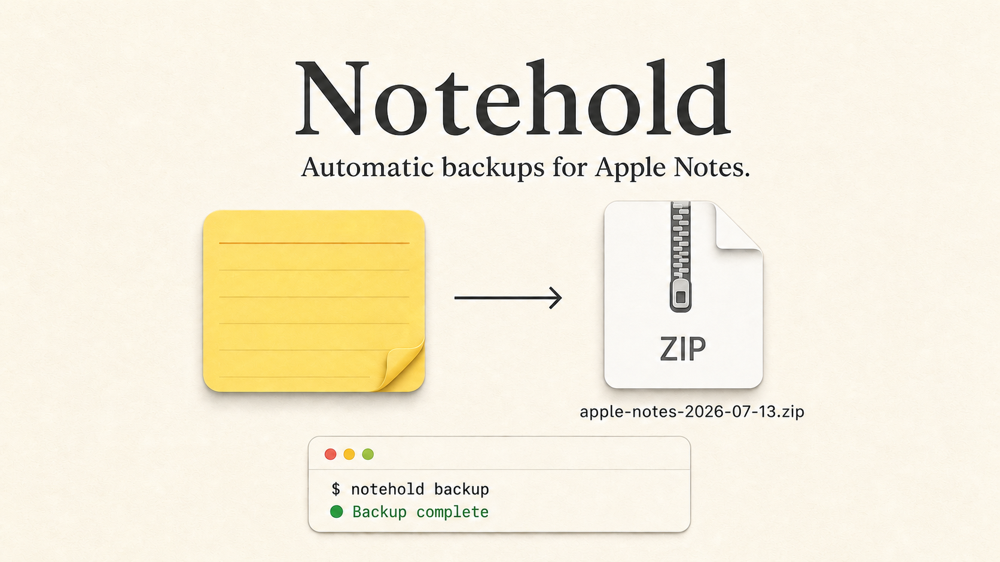

# Notehold

**Automatic backups for Apple Notes.**



Notehold is a command-line backup utility for macOS. It creates dated ZIP archives of your complete local Notes database, checks once a day and after login, and by default creates a new backup when the latest successful one is at least 10 days old.

## Install

First, give `/bin/bash` Full Disk Access in **System Settings > Privacy & Security > Full Disk Access**. Then run:

```sh
git clone https://github.com/rsheyd/notehold.git
notehold/notehold install
```

Installation loads the background job immediately. On a new installation with no completed archive, the first backup starts automatically.

## Contents

- [Getting started](#getting-started): [installation details](#installation-details), [without Git](#install-without-git), and [updates](#update-notehold)
- [Full Disk Access](#full-disk-access)
- [Command reference](#command-reference)
- [Documentation](#documentation)
- [Uninstall](#uninstall)

## Getting started

### Why Notehold?

iCloud keeps Notes synchronized across devices, but synchronization is not the same as keeping independent, dated backups. An accidental edit or deletion can sync to every device. This project gives you ordinary ZIP files that you can inspect, copy, and verify without a proprietary restore tool or repository password.

Time Machine can also protect the Notes database, but it requires separate backup storage, usually an external drive or a supported network destination. If you do not already have that hardware or service, it adds another purchase and setup step. Notehold can instead save portable, dated archives to any folder you choose, including one already synchronized by a cloud-storage service.

For protection from loss or failure of the Mac itself, store the archives somewhere that is copied off the Mac, such as an external drive or a cloud-synced folder. The script verifies each local ZIP and checksum, but it cannot confirm that a cloud provider finished uploading it.

### Installation details

The background job checks immediately, at login, and approximately once a day. When a backup is needed, Notehold briefly closes Notes to create a consistent archive, then reopens it if it was previously open.

Optional Resend email notifications report every newly completed backup and every failed backup attempt. Checks that determine no backup is needed remain quiet, and the API key stays in macOS Keychain.

To enable email, create a [Resend account](https://resend.com), create a sending API key, expose it to the current shell as `RESEND_NOTEHOLD_API_TOKEN`, and run `notehold install` with the destination and sender described in [Configuration](docs/CONFIGURATION.md). Installation copies the key into macOS Keychain because the background LaunchAgent does not read shell startup files such as `.zshrc`.

Resend's `onboarding@resend.dev` address is suitable for initial testing but can send only to the email associated with the Resend account. A custom `from` address must use a domain you own and have verified with Resend; an address at a third-party domain such as `googlegroups.com` cannot be used as the sender.

Backups are saved in `~/Backups/Apple Notes` by default, and redundant older backups are automatically moved to the Mac Trash according to the retention policy.

The installer adds `~/.local/bin` to `PATH`, so `notehold` is available from any directory in new terminal sessions.

### Install without Git

If the `git` command is unavailable and you do not want to install Apple's Command Line Tools, download and extract the latest `notehold-VERSION.tar.gz` file from the [Notehold releases](https://github.com/rsheyd/notehold/releases) page. In Terminal, change to the extracted directory and run:

```sh
./notehold install
```

Give `/bin/bash` Full Disk Access before installation, just as described under [Install](#install). The extracted directory is no longer needed after installation.

### Update Notehold

If you kept the clone created during installation, update it and run the installer again:

```sh
git -C notehold pull --ff-only
notehold/notehold install
```

If you installed without Git, download the newer archive from the [releases page](https://github.com/rsheyd/notehold/releases) and run `./notehold install` again. Updates preserve the installed destination, schedule, and cleanup setting.

## Full Disk Access

The Notes database is stored in another app's protected data container at `~/Library/Group Containers/group.com.apple.notes`. macOS does not treat it like an ordinary document selected by the user. Backup utilities that read another app's private data require the user to grant Full Disk Access; Notehold cannot grant that permission automatically.

The automatic background job runs Notehold's shell scripts through `/bin/bash`, so Bash needs Full Disk Access. Give `/bin/bash` Full Disk Access under **System Settings > Privacy & Security > Full Disk Access** before installation.

In the Full Disk Access file picker, press **Command-Shift-G**, enter `/bin/bash`, and choose **Open**. Make sure the new Bash entry is enabled.

This permission is broader than access for Notehold alone: other scripts run through `/bin/bash` may also be able to read protected files. Notehold uses it to read and archive the local Notes database. Its source is available in this repository for inspection, and the permission can be revoked after running `notehold uninstall`.

Avoiding the Bash permission would require a separately signed executable or Mac app to perform the protected work. That is outside the scope of this command-line release; it would not eliminate the requirement for the user to approve access to the Notes database.

## Command reference

- `notehold backup` creates a backup immediately.
- `notehold status` shows the installed settings, service state, latest activity, and recent backups.
- `notehold list` lists every completed backup newest-first, with its size, date, and checksum-file status.
- `notehold version` shows the installed version.
- `notehold uninstall` removes Notehold without removing backups or logs.

Running `notehold backup` manually requires Full Disk Access for the terminal app running the command, such as Apple's built-in Terminal or a third-party app such as iTerm2. `notehold status`, `notehold version`, and `notehold uninstall` do not require terminal-app Full Disk Access. Automatic backups run through `/bin/bash`, which requires its own Full Disk Access entry.

During a manual backup, Notehold prints its current stage and shows an elapsed-time spinner while creating the archive. Background backups remain quiet and write their activity to the logs.

## Documentation

- [Configuration](docs/CONFIGURATION.md): destination, schedule, cleanup, and retention preview.
- [How Notehold works and troubleshooting](docs/HOW-IT-WORKS.md): verification, failures, installed files, and logs.
- [Configuration](docs/CONFIGURATION.md): destination, schedule, retention, and Resend email notifications.
- [Recovering notes](docs/RECOVERY.md): offline recovery from a backup ZIP.
- [Contributing](CONTRIBUTING.md): local testing and release instructions.

## Uninstall

Run `notehold uninstall` to unload the background job and remove the installed command and program files.

Uninstall never removes backup destinations, ZIP archives, checksum files, or logs. The uninstall script only removes a program directory bearing Notehold's installation marker, only removes the `notehold` command when it points to that installation, and only removes the expected LaunchAgent.

The generic `~/.local/bin` entry remains in `~/.zprofile` after uninstall because other command-line tools may also use that directory.

If `~/.local/bin` is not on `PATH`, run the command by its full path:

```sh
~/.local/bin/notehold uninstall
```
